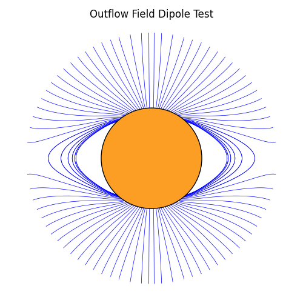

[](https://doi.org/10.5281/zenodo.18864821)
[](https://outflowpy.readthedocs.io/)
[](https://github.com/oekrice/outflowpy/actions/workflows/test_and_build.yml)

A python package for calculating 'outflow fields', as defined in our paper 'Global Coronal Equilibria with Solar Wind Outflow' (https://iopscience.iop.org/article/10.3847/1538-4357/ac2c71), developed primarily by Oliver Rice with Anthony Yeates as the project lead. The package is designed to be compatible in many ways with the existing 'pfsspy' code by David Stansby (https://github.com/dstansby/pfsspy), whereby essentially PFSS fields are regarded a special case of our new model.

The package requires python>=3.9 on Linux or macOS>=14.0 or python>=3.12 on Windows. Older versions of macOS are not supported due to difficulties with the Fortran compilers. 

## Installation
To install, merely run

```
pip install outflowpy
```

## Usage

All code designed around the pfsspy package should work with outflowpy, except for some involving downloading data or plotting. The default functions for obtaining lower boundary conditions have been replaced with new versions based around obtaining data from HMI/MDI, but I am happy to work on alternatives if the need arises. 

For detailed instructions and examples of scripts using outflowpy, please see the full documentation at https://outflowpy.readthedocs.io/en/latest/



## Contact

For any queries, comments, bug reports or suggestions for improvements, please contact oliver.e.rice "at" durham.ac.uk. This is my first attempt at creating a Python package so I appreciate it is quite rough and ready in places!
