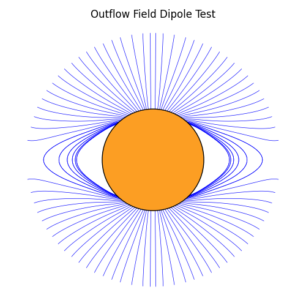

Basic Dipole Calculation, Tracing and Plotting
==============================================

This example demonstrates most of the functionality of outflowpy for a basic dipole solution using the default outflow profile.

.. code-block:: python

    import outflowpy

    import numpy as np
    import astropy.constants as const
    import matplotlib.pyplot as plt
    import matplotlib.patches as patches
    from astropy.time import Time
    import sunpy.map

    #Model resolution
    ns = 90
    nphi = 180
    nrho = 60
    #Source-surface height (in solar radii)
    rss = 2.5

    #Analytic lower boundary condition
    phi = np.linspace(0, 2 * np.pi, nphi)
    s = np.linspace(-1, 1, ns)
    s, phi = np.meshgrid(s, phi)
    def dipole_Br(r, s):
        return s**7
    br = dipole_Br(1, s)

    #Create sunpy headers for this analytic data (when downloading real data this is more meaningful)
    header = outflowpy.utils.carr_cea_wcs_header(Time('2020-1-1'), br.shape)
    input_map = sunpy.map.Map((br.T, header))

    #Default outflow field initial condition (using an optimised solar wind flow)
    outflow_in = outflowpy.Input(input_map, nrho, rss)

    #Compute the field (this uses the Fortran module)
    outflow_out = outflowpy.outflow_fortran(outflow_in)

    #Find field line seeds (in the plane of view) and trace the field lines (using the Fortran 'FastTracer' in native spherical coordinates)
    seeds = outflowpy.utils.equal_seed_sampler(outflow_out, 100, 1.5)
    tracer = outflowpy.tracing.FastTracer()
    field_lines = tracer.trace(seeds, outflow_out, save_flag = True)

    #Make a figure of these field lines
    fig = plt.figure(figsize = (5.0, 5.0))
    transformed_lines = []
    for fi, fline in enumerate(field_lines):
        coords = fline.coords
        coords.representation_type = 'cartesian'
        line = np.zeros((2, len(coords)))
        line[0,:] = coords.y/const.R_sun; line[1,:] = coords.z/const.R_sun
        transformed_lines.append([line[0,:], line[1,:]])

        plt.gca().plot(line[0,:], line[1,:], c = 'blue', linewidth = 0.5, zorder = 0)

    circle = patches.Circle(
        (0.0, 0.0),
        1.0,
        facecolor="#fc9e23",
        edgecolor="black",
        linewidth=1
    )

    plt.gca().add_patch(circle)
    plt.gca().axis('equal')
    plt.gca().set_xticks([])
    plt.gca().set_yticks([])
    plt.gca().set_axis_off()
    plt.gca().set_title("Outflow Field Dipole Test")

    plt.tight_layout()
    plt.show()

