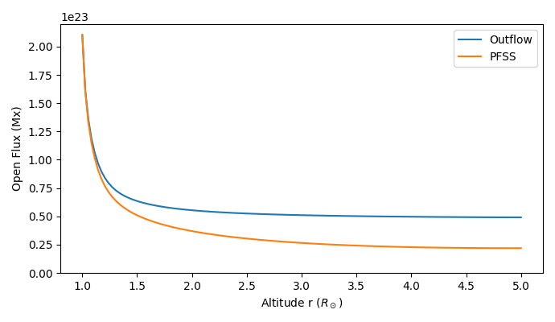

Outflow Speed Comparison
========================

This example calculates PFSS and Outflow fields, and plots the Open Flux (OSF) as a function of height for both

.. code-block:: python

    import outflowpy
    import numpy as np
    import random
    import matplotlib.pyplot as plt
    import astropy.constants as const
    import matplotlib.patches as patches

    #Specify model resolutions
    ns = 90
    nphi = 180
    nrho = 60
    rss = 5.0

    #Download data for a specific date and time
    obs_time = "2017-08-21T00:00:00"
    hmi_map = outflowpy.obtain_data.prepare_hmi_mdi_time(obs_time, ns, nphi, smooth = 1.0*5e-2/nphi, use_cached = True)

    #Set up Input files for PFSS and default outflow profile
    pfss_in = outflowpy.Input(hmi_map, nrho, rss, mf_constant = 0.0)
    outflow_in = outflowpy.Input(hmi_map, nrho, rss)

    #Calculate the magnetic fields
    pfss_out = outflowpy.outflow(pfss_in)
    outflow_out = outflowpy.outflow(outflow_in)

    #Define function for calculating open flux as a function of height
    def find_oflux_profile(br):
        """
        Outputs the open flux profile (in Maxwells) as an array aligned with radial grid centres
        """
        rsun_cm = 6.957e10
        ofluxes = np.zeros(np.shape(br)[2])
        for i in range(np.shape(br)[2]):
            surface_area = 4*np.pi*(np.exp(outflow_in.grid.rg[i])*rsun_cm)**2
            ofluxes[i] = np.sum(np.abs(br)[:,:,i])*surface_area/(nphi*ns)
        return ofluxes

    ofluxes_pfss = find_oflux_profile(pfss_out.br)
    ofluxes_outflow = find_oflux_profile(outflow_out.br)

    fig, ax = plt.subplots(1,1, figsize = (6.9, 4.0))

    plt.plot(np.exp(outflow_in.grid.rg), ofluxes_outflow, linewidth = 1.5, label = "Outflow")
    plt.plot(np.exp(pfss_in.grid.rg), ofluxes_pfss, linewidth = 1.5, label = "PFSS")

    plt.ylim(ymin = 0)
    plt.xlabel('Altitude r ($R_\odot$)')
    plt.ylabel('Open Flux (Mx)')
    plt.legend()
    plt.tight_layout()

    plt.tight_layout()
    plt.show()

Expected output:

