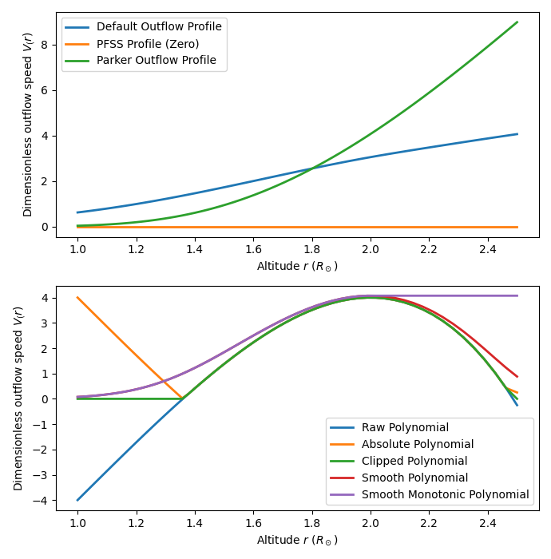

Outflow Speed Comparison
========================

This example shows the various methods for generating outflow profiles and plots them

.. code-block:: python

    import outflowpy

    import matplotlib.pyplot as plt
    import numpy as np
    from astropy.time import Time
    import sunpy.map

    #Model resolution
    ns = 90
    nphi = 180
    nrho = 60
    #Source-surface height (in solar radii)
    rss = 2.5

    #Analytic lower boundary condition. This is necessary as the Input class requires a map, and using a dipole is faster than downloading data
    phi = np.linspace(0, 2 * np.pi, nphi)
    s = np.linspace(-1, 1, ns)
    s, phi = np.meshgrid(s, phi)
    def dipole_Br(r, s):
        return s**7
    br = dipole_Br(1, s)

    #Create sunpy headers for this analytic data (when downloading real data this is more meaningful)
    header = outflowpy.utils.carr_cea_wcs_header(Time('2020-1-1'), br.shape)
    input_map = sunpy.map.Map((br.T, header))

    #Generate outflow profiles using defaults or Parker
    fig, axs = plt.subplots(2,1, figsize = (6.9, 7.0))

    ax = axs[0]
    #Default profile (optimised for field line shapes)
    outflow_in_default = outflowpy.Input(input_map, nrho, rss)
    #PFSS solution (zero outflow)
    outflow_in_pfss = outflowpy.Input(input_map, nrho, rss, mf_constant = 0.0)
    #Parker solution with specified sound speed in m/s
    outflow_in_parker = outflowpy.Input(input_map, nrho, rss, mf_constant = 5e-17, sound_speed = 125e3)

    ax.plot(np.exp(outflow_in_default.grid.rg), outflow_in_default.vg, label = "Default Outflow Profile", linewidth = 2.)
    ax.plot(np.exp(outflow_in_pfss.grid.rg), outflow_in_pfss.vg, label = "PFSS Profile (Zero)", linewidth = 2.)
    ax.plot(np.exp(outflow_in_parker.grid.rg), outflow_in_parker.vg, label = "Parker Outflow Profile", linewidth = 2.)

    ax.set_xlabel('Altitude $r$ ($R_\odot$)')
    ax.set_ylabel('Dimensionless outflow speed $V_(r)$')
    ax.legend()

    #Generate outflow profiles using specified polynomials
    ax = axs[1]
    #Specify polynomial coefficients (these are randomly picked to illustrate the differences between the types)
    coeffs = [-14, 8, 1.5, 1.5, -1.0]
    #Raw polynomial (will create errors if negative -- as this does)
    outflow_in_raw = outflowpy.Input(input_map, nrho, rss, polynomial_coeffs = coeffs, polynomial_type = 'raw')
    #Absolute value of the polynomial
    outflow_in_abs = outflowpy.Input(input_map, nrho, rss, polynomial_coeffs = coeffs, polynomial_type = 'abs')
    #Clipped polynomial
    outflow_in_clip = outflowpy.Input(input_map, nrho, rss, polynomial_coeffs = coeffs, polynomial_type = 'clip')
    #Smooth polynomial
    outflow_in_smooth = outflowpy.Input(input_map, nrho, rss, polynomial_coeffs = coeffs, polynomial_type = 'smooth')
    #Smooth monotonic polynomial
    outflow_in_smooth_monotone = outflowpy.Input(input_map, nrho, rss, polynomial_coeffs = coeffs, polynomial_type = 'smooth_monotonic')

    ax.plot(np.exp(outflow_in_raw.grid.rg), outflow_in_raw.vg, label = "Raw Polynomial", linewidth = 2.)
    ax.plot(np.exp(outflow_in_abs.grid.rg), outflow_in_abs.vg, label = "Absolute Polynomial", linewidth = 2.)
    ax.plot(np.exp(outflow_in_clip.grid.rg), outflow_in_clip.vg, label = "Clipped Polynomial", linewidth = 2.)
    ax.plot(np.exp(outflow_in_smooth.grid.rg), outflow_in_smooth.vg, label = "Smooth Polynomial", linewidth = 2.)
    ax.plot(np.exp(outflow_in_smooth_monotone.grid.rg), outflow_in_smooth_monotone.vg, label = "Smooth Monotonic Polynomial", linewidth = 2.)

    ax.set_xlabel('Altitude $r$ ($R_\odot$)')
    ax.set_ylabel('Dimensionless outflow speed $V_(r)$')
    ax.legend()

    plt.tight_layout()
    plt.show()

Expected output:

