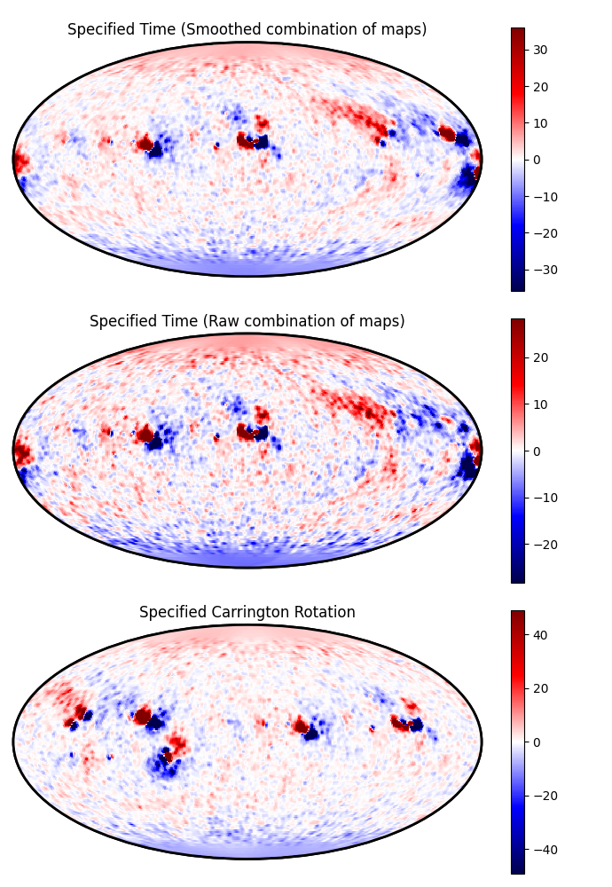

Download and plot HMI/MDI data
==============================

This example downloads the data for either a specified time (of the 2017 eclipse) or for a specified Carrington Rotation, and plots the input data on a Mollweide projection.

.. code-block:: python

    import outflowpy

    import matplotlib.pyplot as plt
    import numpy as np

    #Define the plotting function
    def plot_boundary_data(ax, data, title):
        lon_edges = np.linspace(-np.pi, np.pi, nphi+1)
        lat_edges = np.arccos(np.linspace(1., -1., ns+1)) - np.pi/2
        vmax = np.percentile(data, 99.5)
        im = ax.pcolormesh(lon_edges, lat_edges, data, vmin = -vmax, vmax = vmax, cmap = 'seismic', rasterized=True)
        ax.patch.set_linewidth(2)
        ax.patch.set_edgecolor("black")

        for spine in ax.spines.values():
            spine.set_edgecolor("black")
            spine.set_linewidth(2)

        ax.set_xticks([])
        ax.set_yticks([])
        plt.colorbar(im)

        ax.set_title(title)

        return

    #Specify resolutions for the out
    ns = 180
    nphi = 360
    nrho = 60

    #Specify observation time
    obs_time = "2017-08-21T00:00:00"

    #Download and prepare the data for this time
    hmi_map_time = outflowpy.obtain_data.prepare_hmi_mdi_time(obs_time, ns, nphi, smooth = 1.0*5e-2/nphi, use_cached = True)
    hmi_map_time_raw = outflowpy.obtain_data.prepare_hmi_mdi_time(obs_time, ns, nphi, smooth = 1.0*5e-2/nphi, use_cached = True, interpolate_synoptic_maps=False)
    hmi_map_crot = outflowpy.obtain_data.prepare_hmi_mdi_crot(2194, ns, nphi, smooth = 1.0*5e-2/nphi, use_cached = True)

    #Create the Input objects. Outflow profile doesn't matter so just specify PFSS.
    outflow_in_time = outflowpy.Input(hmi_map_time, nrho, 2.5, mf_constant = 0.0)
    outflow_in_time_raw = outflowpy.Input(hmi_map_time_raw, nrho, 2.5, mf_constant = 0.0)
    outflow_in_crot = outflowpy.Input(hmi_map_crot, nrho, 2.5, mf_constant = 0.0)

    #Plot this boundary data
    fig, axs = plt.subplots(3,1, subplot_kw = {"projection": "mollweide"}, figsize = (6.9, 10.0))

    ax = axs[0]
    plot_boundary_data(ax, outflow_in_time.br, 'Specified Time (Smoothed combination of maps)')
    ax = axs[1]
    plot_boundary_data(ax, outflow_in_time_raw.br, 'Specified Time (Raw combination of maps)')
    ax = axs[2]
    plot_boundary_data(ax, outflow_in_crot.br, 'Specified Carrington Rotation')

    plt.tight_layout()
    plt.show()

Expected output:

